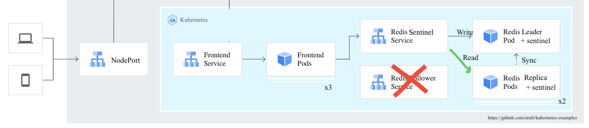

# Improved Guestbook from Kubernetes Examples

This directory is forked from the well-known Kubernetes examples.

The goal is to build a **more robust redis db without persistent volumes**.

I've enhanced the Redis setup by setting up a sentinel redis cluster :
- **new frontend image** (up to date PHP and using a client redis sentinel client code)
- added **redis password** (at first static, but soon based on kubernetes secret)
- added redis-values.yaml used when **deploying the redis sentinel with the Bitnami's helm package**
- added Github Action workflow for building the Docker image and pushing it on Dockerhub

See the branches for incremental changes.

https://hub.docker.com/repository/docker/reytans/guestbook-ng is the frontend image replacement. 
